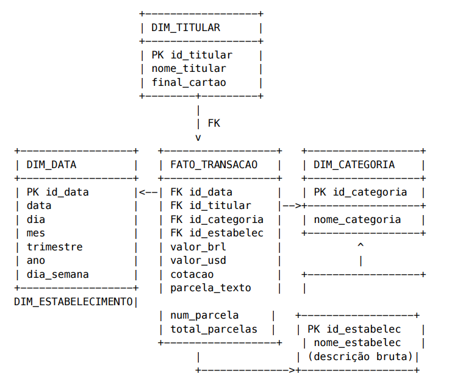

# Business Intelligence - Trabalho Aula

### Relatório de Faturas de Cartões

### Campos Utilizados

- <u>nome e final do cartão</u>  
importante para identificar o usuário

- <u>data da compra e data da parcela</u>  
importante já que elas irão dar a partida na análise dos dados, sendo separadas em seus respectivos períodos para análise  

- <u>categoria e descrição</u>  
ao separar os gastos por categoria fica mais fácil compreender os dados conforme as prioridades e necessidades do usuário

- <u>valor</u>  
o principal campo da análise de dados, já que com ele serão feitos os cálculos dos gastos especificados

#

### Data Warehouse -> Star Schema  

  

#

### Estrutura no SQL

```
-- =========================
-- DIMENSÃO DATA
-- =========================
CREATE TABLE dim_data (
    id_data INT PRIMARY KEY,
    data DATE NOT NULL,
    dia INT,
    mes INT,
    trimestre INT,
    ano INT,
    dia_semana VARCHAR(20)
);

-- =========================
-- DIMENSÃO TITULAR
-- =========================
CREATE TABLE dim_titular (
    id_titular INT PRIMARY KEY,
    nome_titular VARCHAR(100),
    final_cartao CHAR(4)
);

-- =========================
-- DIMENSÃO CATEGORIA
-- =========================
CREATE TABLE dim_categoria (
    id_categoria INT PRIMARY KEY,
    nome_categoria VARCHAR(100)
);

-- =========================
-- DIMENSÃO ESTABELECIMENTO
-- =========================
CREATE TABLE dim_estabelecimento (
    id_estabelecimento INT PRIMARY KEY,
    nome_estabelecimento VARCHAR(255)
);

-- =========================
-- TABELA FATO
-- =========================
CREATE TABLE fato_transacao (
    
    id_data INT,
    id_titular INT,
    id_categoria INT,
    id_estabelecimento INT,

    valor_brl DECIMAL(12,2),
    valor_usd DECIMAL(12,2),
    cotacao DECIMAL(10,4),

    parcela_texto VARCHAR(20),
    num_parcela INT,
    total_parcelas INT,

    -- CHAVES ESTRANGEIRAS
    CONSTRAINT fk_data
        FOREIGN KEY (id_data)
        REFERENCES dim_data(id_data),

    CONSTRAINT fk_titular
        FOREIGN KEY (id_titular)
        REFERENCES dim_titular(id_titular),

    CONSTRAINT fk_categoria
        FOREIGN KEY (id_categoria)
        REFERENCES dim_categoria(id_categoria),

    CONSTRAINT fk_estabelecimento
        FOREIGN KEY (id_estabelecimento)
        REFERENCES dim_estabelecimento(id_estabelecimento)
);
```

#

### <u>Perguntas de Negócio</u>  
> Quanto foi gasto por mês?  
> Em qual categoria os usuários gastam mais?  
> Qual categoria tem mais transações?  
> Qual porcentagem do gasto total é de cada categoria?  
> Evolução mensal dos gastos  
> Contagem de compras parceladas e compras à vista  
> Qual usuário gastou mais?
> Quantas compras são parceladas vs à vista?

<u>Situação Atual</u>  
	hoje em dia o usuário pega o extrato da conta e analisa manualmente os gastos separando eles por categoria, parcelas, data de compra

<u>Benefícios de Aplicar BI</u>  
	com o BI aplicado ficaria melhor a visualização de gastos conforme os campos especificados do usuário, para melhor compreensão visual dos gastos.

#

### Instalar Dependências

- pip install -r requirements.txt

### Run

- python etl_papeline.py

