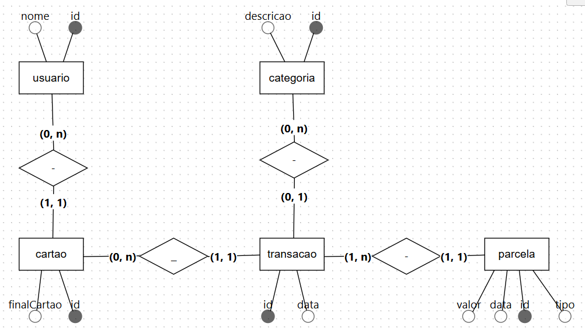
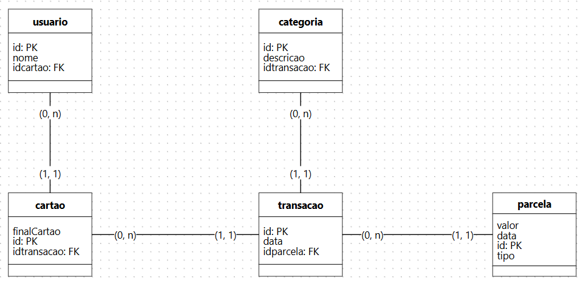

# Business Intelligence - Trabalho

### Campos Utilizados

- <u>nome e final do cartão</u>  
importante para identificar o usuário

- <u>data da compra e data da parcela</u>  
importante já que elas irão dar a partida na análise dos dados, sendo separadas em seus respectivos períodos para análise  

- <u>categoria e descrição</u>  
ao separar os gastos por categoria fica mais fácil compreender os dados conforme as prioridades e necessidades do usuário

- <u>valor</u>  
o principal campo da análise de dados, já que com ele serão feitos os cálculos dos gastos especificados

### <u>Perguntas de Negócio</u>  
> quais categorias tiveram mais gastos por mês/bimestre/semestre  
> quais categorias tiveram menos gastos por mês/bimestre/semestre  
> evolução mensal dos gastos  
> rank de meses com mais gastos  
> rank de meses que mais tiveram gastos comparados com as categorias  
> rank dos anos que mais tiveram gastos  
> contagem de compras parceladas e compras à vista  

<u>Situação Atual</u>  
	hoje em dia o usuário pega o extrato da conta e analisa manualmente os gastos separando eles por categoria, parcelas, data de compra

<u>Benefícios de Aplicar BI</u>  
com o BI aplicado ficaria melhor a visualização de gastos conforme os campos especificados do usuário, para melhor compreensão visual dos gastos.

	
```

## Modelo Conceitual



## Modelo Lógico



## SQL

```

CREATE DATABASE Cartaoaula;

CREATE TABLE Parcelas (
    id INT AUTO_INCREMENT PRIMARY KEY,
    numero INT,
    total INT,
    valor DECIMAL(10,2),
    data VARCHAR(15)
);

CREATE TABLE Transacoes (
    id INT AUTO_INCREMENT PRIMARY KEY,
    data VARCHAR(15),
    parcelaId INT,
    FOREIGN KEY (parcelaId) REFERENCES Parcelas(id)
);

CREATE TABLE Cartoes (
    id INT AUTO_INCREMENT PRIMARY KEY,
    finalCartao INT,
    transacaoId INT,
    FOREIGN KEY (transacaoId) REFERENCES Transacoes(id)
);

CREATE TABLE Usuarios (
    id INT AUTO_INCREMENT PRIMARY KEY,
    nome VARCHAR(40),
    cartaoId INT,
    FOREIGN KEY (cartaoId) REFERENCES Cartoes(id)
);

CREATE TABLE Categorias (
    id INT AUTO_INCREMENT PRIMARY KEY,
    descricao VARCHAR(30),
    transacaoId INT,
    FOREIGN KEY (transacaoId) REFERENCES Transacoes(id)
);

```

#

### Instalar Dependências

- pip install -r requirements.txt

### Run

- python main.py

